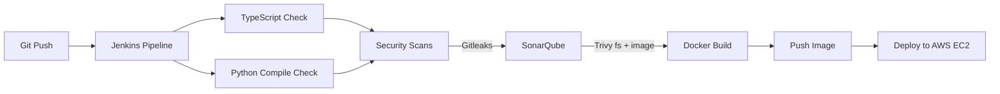

<h1 align="center">Hi 👋, I'm Majidulla SK</h1>
<h3 align="center">DevOps Engineer | Cloud Engineer | Kubernetes | AWS</h3>

<p align="center">
  
</p>

<p align="center">
  <a href="https://linkedin.com/in/majidulla-sk-1190a2286"></a>
  <a href="mailto:majidullask04@gmail.com"></a>
  <a href="https://github.com/Majidullask04"></a>
</p>

<p align="center">
  <a href="https://github.com/Majidullask04"></a>
  
</p>

---

### 🧠 About Me

- 🎓 B.Tech Computer Science and Engineering student (2023–2027) at Brilliant Institute of Engineering and Technology (JNTUH), Hyderabad — CGPA 7.5
- ⚙️ DevOps Engineer with hands-on experience building production-style CI/CD pipelines, Kubernetes platforms, cloud infrastructure, and DevSecOps workflows
- ☁️ Skilled in AWS, Docker, Kubernetes, Jenkins, GitHub Actions, Terraform, Argo CD, Prometheus, and Grafana
- 🌐 Contributing documentation to **CNCF** open source projects (LFX Open Source — Completed)
- 📍 Hyderabad, Telangana, India
- 📫 **majidullask04@gmail.com**

---

### ⚙️ Tech Stack

<p align="center">
  
</p>

**Cloud** — AWS (EC2, S3, IAM, EKS, Amplify, CloudWatch), Linux (Ubuntu), Bash/Shell Scripting
**Containers** — Docker, Docker Compose, Docker Hub, Kubernetes (K3s, EKS), Helm
**CI/CD** — Jenkins (Declarative Pipelines, Shared Libraries), GitHub Actions, Webhooks
**DevSecOps** — SonarQube (Quality Gates), Trivy (Vulnerability Scanning), Gitleaks (Secret Detection)
**Monitoring** — Prometheus, Grafana (Dashboards, Alerting), Kubernetes Workload Observability
**GitOps / IaC** — Argo CD (Auto-sync), Terraform
**Databases** — MongoDB, MySQL
**Languages** — Python, Java, JavaScript, TypeScript, Bash, HTML, CSS
**Tools** — Git, GitHub, Nginx, Postman, YAML, gRPC, Microservices Architecture

---

### 🚀 Featured Projects

**[Production DevSecOps CI/CD Platform](https://github.com/Majidullask04/3-Tier-DevSecOps-Mega-Project)**
`Jenkins` `Docker` `Kubernetes` `SonarQube` `Trivy` `Gitleaks` `K3s`
- Production-ready Jenkins Declarative Pipeline with dynamic Docker discovery, building 11+ microservices with zero manual configuration
- Full DevSecOps workflow: Gitleaks secret detection, SonarQube Quality Gates, Trivy scanning for filesystems and containers
- Multi-architecture Docker builds (ARM64/AMD64) with automated Docker Hub tagging
- Streamlined build → push → deploy flow to K3s, cutting manual deployment effort by ~90%

**[Google Microservices Demo — Kubernetes Deployment](https://github.com/Majidullask04/microservices-demo)**
`Kubernetes` `Docker Compose` `gRPC` `Service Discovery` `GitOps`
- Deployed Google's official 11-service Cymbal Shops microservices demo across Docker Compose and Kubernetes
- Configured service-to-service communication, load balancing, and self-healing for distributed microservices architecture
- Full build documented in a companion [documentation repo](https://github.com/Majidullask04/microservices-devops-platform-Documentation-)

**[AWS Amplify Deployment](https://github.com/Majidullask04/amplify-vite-react-template)**
`React` `Vite` `AWS Amplify`
- React/Vite frontend with automated deployment via AWS Amplify Gen 2

**[Three-Tier Application with Docker Compose](https://github.com/Majidullask04/Three-Tier-Applications)**
`Docker` `Docker Compose` `Multi-tier Architecture`
- Deployed and managed a multi-tier full-stack application with Docker and Docker Compose for improved scalability and portability

**[CI/CD Automation](https://github.com/Majidullask04/ci-cd-automation)**
`CI/CD` `Automation`
- Ongoing pipeline automation work — build, test, and deployment workflows

**[Node.js REST API with MongoDB & Containerized CI/CD](https://github.com/Majidullask04/node-express-mongoose-demo)**
`Node.js` `Express` `MongoDB` `Docker` `CI/CD`
- CRUD REST API with MongoDB integration, containerized with Docker
- Automated CI/CD pipeline for testing, building, and deploying with integrated security scanning

---

### 🚧 Currently Building — [ExamAid Pro](https://github.com/Majidullask04/examaid-pro)

```text
Frontend   → Vite + React + TypeScript
Backend    → FastAPI (Python)
Container  → Single Docker image
CI/CD      → Jenkins pipeline
Security   → Gitleaks · SonarQube · Trivy (fs + image scan)
Deploy     → AWS EC2
```



---

### 🌱 Open Source

- Contributing documentation to CNCF projects — clarified LFX Crowdfunding usage for maintainers
- LFX Open Source contributor (Completed) · MLH Global Hack Week participant

---

### 📊 GitHub Stats

<p align="center">
  
  
</p>

<p align="center">
  
</p>

<p align="center">
  
</p>

---

### 🧊 3D Contribution Summary

<p align="center">
  
</p>
<p align="center">
  
  
</p>

> Generated via [github-profile-summary-cards](https://github.com/vn7n24fzkq/github-profile-summary-cards). Add `summary-cards.yml` to `.github/workflows/`, push, and it commits the card SVGs into a `profile-summary-card-output/` folder in this repo — self-hosted, so it won't break if the public demo service goes down.

---

### 🐍 Contribution Snake

<p align="center">
  <picture>
    <source media="(prefers-color-scheme: dark)" srcset="https://raw.githubusercontent.com/Majidullask04/Majidullask04/output/github-contribution-grid-snake-dark.svg" />
    <source media="(prefers-color-scheme: light)" srcset="https://raw.githubusercontent.com/Majidullask04/Majidullask04/output/github-contribution-grid-snake.svg" />
    
  </picture>
</p>

> Generated via [Platane/snk](https://github.com/Platane/snk). Add `snake.yml` to `.github/workflows/` in this repo, push, and it renders within a few minutes on the `output` branch.

---

### 🏆 Trophies

<p align="center">
  
</p>

---

### 🎯 Certifications

- AWS Certified Cloud Practitioner — *Preparing*
- Certified Kubernetes Administrator (CKA) — *Preparing*
- Terraform Associate — *Preparing*
- LFX Open Source — *Completed*
- MLH Global Hack Week — *Participated*

---

### 📈 2026 Roadmap

- [x] Master Jenkins CI/CD pipelines with integrated DevSecOps scanning
- [x] Build production Kubernetes platform with GitOps (Argo CD)
- [ ] Pass AWS Cloud Practitioner and CKA certifications
- [ ] Deepen CNCF open source contributions
- [ ] Ship ExamAid Pro v1.0 to AWS EC2
- [ ] System design fundamentals

---

<p align="center"><i>"Automate everything that can be automated — then go build something new."</i></p>
