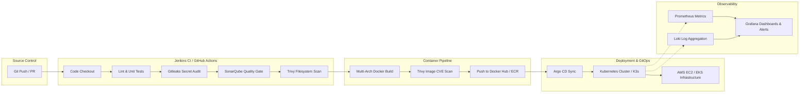

<h1 align="center">Hi 👋, I'm Majidulla SK</h1>
<h3 align="center">AI Full-Stack Engineer | DevOps & Cloud Specialist</h3>

<p align="center">
  
</p>

<p align="center">
  <a href="https://live-resume-2-0.vercel.app/"></a>
  <a href="https://linkedin.com/in/majidulla-sk-1190a2286"></a>
  <a href="https://x.com/majidulla_sk"></a>
  <a href="mailto:majidullask04@gmail.com"></a>
  <a href="https://github.com/Majidullask04"></a>
</p>

<p align="center">
  
  <a href="https://github.com/Majidullask04"></a>
  
</p>

---

### 🧠 About Me

- 🚀 **AI Full-Stack & Cloud/DevOps Trajectory**: Actively engineering robust backend systems with **Node.js**, **Express**, **FastAPI**, and **MongoDB**, developing responsive interfaces with **React** & **TypeScript**, and mastering **Machine Learning (ML)** fundamentals.
- 🎓 **Education**: B.Tech in Computer Science and Engineering (2023–2027) at **Brilliant Institute of Engineering and Technology (JNTUH)**, Hyderabad — **CGPA 7.5**.
- ⚙️ **DevOps & Cloud Engineering**: Proven track record designing production-style CI/CD pipelines, Kubernetes platforms (K3s/EKS), AWS infrastructure (EC2, S3, IAM, VPC, CloudFront, EKS), and automated DevSecOps workflows.
- 🌐 **CNCF Open Source**: Active contributor to the CNCF ecosystem (**CLOWarden**, **LFX Crowdfunding**) through the **Linux Foundation (LFX Mentorship)** program.
- 📍 **Location**: Hyderabad, Telangana, India
- 📫 **Reach Me**: [majidullask04@gmail.com](mailto:majidullask04@gmail.com) | [Live Interactive Resume](https://live-resume-2-0.vercel.app/)

---

### ⚙️ Core Competencies & Tech Stack

<p align="center">
  
</p>

| Category | Technologies & Tools |
| :--- | :--- |
| **Cloud & Infrastructure** | **AWS** (EC2, S3, IAM, VPC, CloudFront, EKS, ECR, CloudWatch, Amplify), **Terraform**, **Linux (Ubuntu)**, **Bash / Shell**, **Nginx** |
| **Containers & Orchestration** | **Docker**, **Docker Compose**, **Kubernetes (K3s, EKS)**, **Helm**, **Istio Service Mesh**, **gRPC** |
| **CI/CD & DevSecOps** | **Jenkins** (Declarative Pipelines, Shared Libs), **GitHub Actions**, **Argo CD** (GitOps), **SonarQube** (Quality Gates), **Trivy** (CVE Scanner), **Gitleaks** (Secrets Audit) |
| **AI & Full-Stack** | **Python**, **FastAPI**, **Node.js**, **Express.js**, **React**, **TypeScript**, **JavaScript**, **Vite**, **Tailwind CSS**, **Machine Learning** fundamentals |
| **Observability & SRE** | **Prometheus** (Metrics Scraping), **Grafana** (Dashboards & Alerts), **Loki** (Log Aggregation), **CloudWatch** |
| **Databases & Tools** | **MongoDB**, **MySQL**, **Git**, **GitHub**, **Postman**, **Vercel**, **YAML**, **Systemd** |

---

### 🚀 Featured Projects

<table>
  <tr>
    <td width="50%" valign="top">
      <h3>🤖 <a href="https://github.com/Majidullask04/career-ops">career-ops</a></h3>
      <p><b>Open-Source AI Job Search Tool & Terminal Agent</b></p>
      <p>Scans job portals, grades listings with an A–F fit score, tailors resume JSON/Markdown, and tracks applications locally inside AI coding CLIs (Claude Code, Gemini, OpenCode).</p>
      <p>
        <code>TypeScript</code> <code>Node.js</code> <code>AI CLI</code> <code>Automation</code> <code>Git</code>
      </p>
      <p>
        <a href="https://career-ops.org"><b>🌐 Live Website</b></a> · <a href="https://github.com/Majidullask04/career-ops"><b>📂 GitHub Repo</b></a>
      </p>
    </td>
    <td width="50%" valign="top">
      <h3>🛡️ <a href="https://github.com/Majidullask04/3-Tier-DevSecOps-Mega-Project">3-Tier DevSecOps Mega Project</a></h3>
      <p><b>Production CI/CD & Kubernetes Deployment Platform</b></p>
      <p>Production-ready Jenkins pipeline with dynamic Docker discovery building 11+ microservices. Integrates Gitleaks, SonarQube Quality Gates, Trivy CVE scanning, and K3s GitOps sync with Argo CD.</p>
      <p>
        <code>Jenkins</code> <code>Docker</code> <code>Kubernetes (K3s)</code> <code>SonarQube</code> <code>Trivy</code> <code>Argo CD</code>
      </p>
      <p>
        <a href="https://github.com/Majidullask04/3-Tier-DevSecOps-Mega-Project"><b>📂 GitHub Repo</b></a> · <a href="https://github.com/Majidullask04/microservices-devops-platform-Documentation-"><b>📖 Documentation & Proof</b></a>
      </p>
    </td>
  </tr>
  <tr>
    <td width="50%" valign="top">
      <h3>☁️ <a href="https://github.com/Majidullask04/Majid-s-DevOps-implementation-of-Google-s-project.">Google Microservices Platform</a></h3>
      <p><b>10-Microservice Distributed Architecture & Service Mesh</b></p>
      <p>DevOps implementation of Google's Cymbal Shops microservices on Kubernetes with Istio Service Mesh, gRPC inter-service communication, distributed tracing, and self-healing telemetry.</p>
      <p>
        <code>Go</code> <code>Kubernetes</code> <code>Istio</code> <code>gRPC</code> <code>Docker</code> <code>Helm</code>
      </p>
      <p>
        <a href="https://cymbal-shops.retail.cymbal.dev"><b>🌐 Live Demo</b></a> · <a href="https://github.com/Majidullask04/Majid-s-DevOps-implementation-of-Google-s-project."><b>📂 GitHub Repo</b></a>
      </p>
    </td>
    <td width="50%" valign="top">
      <h3>🎓 <a href="https://github.com/Majidullask04/examaid-pro">ExamAid Pro</a></h3>
      <p><b>Full-Stack Educational Platform on AWS EC2</b></p>
      <p>Comprehensive educational assistance platform built with React, Vite, and TypeScript frontend, FastAPI backend, SonarQube code audits, containerized with Docker and deployed on AWS EC2.</p>
      <p>
        <code>React</code> <code>TypeScript</code> <code>FastAPI</code> <code>AWS EC2</code> <code>Nginx</code> <code>Docker</code>
      </p>
      <p>
        <a href="https://github.com/Majidullask04/examaid-pro"><b>📂 GitHub Repo</b></a>
      </p>
    </td>
  </tr>
  <tr>
    <td width="50%" valign="top">
      <h3>💰 <a href="https://github.com/Majidullask04/Expense-tracker">Expense Tracker Web App</a></h3>
      <p><b>Full-Stack Financial Dashboard & Analytics</b></p>
      <p>Interactive expense tracker featuring transaction analytics, visual budget charts, and automated continuous deployment workflows on Vercel.</p>
      <p>
        <code>JavaScript</code> <code>React</code> <code>Node.js</code> <code>Vercel</code> <code>CSS3</code>
      </p>
      <p>
        <a href="https://expense-tracker-delta-taupe-40.vercel.app"><b>🌐 Live App</b></a> · <a href="https://github.com/Majidullask04/Expense-tracker"><b>📂 GitHub Repo</b></a>
      </p>
    </td>
    <td width="50%" valign="top">
      <h3>🏥 <a href="https://github.com/Majidullask04/HomeoCare_2.0">HomeoCare 2.0</a></h3>
      <p><b>Modern Healthcare & Consultation Portal</b></p>
      <p>Healthcare appointment and patient portal application featuring digital consultation booking and responsive UI deployed on Vercel.</p>
      <p>
        <code>TypeScript</code> <code>React</code> <code>Vite</code> <code>TailwindCSS</code> <code>Vercel</code>
      </p>
      <p>
        <a href="https://homeo-care-2-0.vercel.app"><b>🌐 Live App</b></a> · <a href="https://github.com/Majidullask04/HomeoCare_2.0"><b>📂 GitHub Repo</b></a>
      </p>
    </td>
  </tr>
  <tr>
    <td width="50%" valign="top">
      <h3>⚡ <a href="https://github.com/Majidullask04/ci-cd-automation">CI/CD Security Automation</a></h3>
      <p><b>7-Stage Automated Security Pipeline</b></p>
      <p>Automated security pipeline executing static code analysis, secrets audits, and container vulnerability scanning prior to pushing hardened images to Docker Hub.</p>
      <p>
        <code>Jenkins</code> <code>Docker</code> <code>SonarQube</code> <code>Trivy</code> <code>Gitleaks</code> <code>Bash</code>
      </p>
      <p>
        <a href="https://github.com/Majidullask04/ci-cd-automation"><b>📂 GitHub Repo</b></a>
      </p>
    </td>
    <td width="50%" valign="top">
      <h3>🌐 <a href="https://github.com/Majidullask04/clowarden">CLOWarden (CNCF Ecosystem)</a></h3>
      <p><b>Cross-Service Resource Access Management</b></p>
      <p>CNCF ecosystem open-source project for managing resource access. Contributed maintainer documentation and community pull request reviews.</p>
      <p>
        <code>Go</code> <code>CNCF</code> <code>Linux Foundation</code> <code>YAML</code> <code>Git</code>
      </p>
      <p>
        <a href="https://github.com/Majidullask04/clowarden"><b>📂 GitHub Repo</b></a>
      </p>
    </td>
  </tr>
</table>

---

### 🛡️ End-to-End DevSecOps Architecture



---

### 🌱 Experience & Open Source

```text
2024 – Present   CNCF Open Source Contributor  | Linux Foundation (LFX Mentorship)
                 • Active contributor to CNCF ecosystem projects (CLOWarden, LFX Crowdfunding)
                 • Authored documentation updates clarifying maintainer setups

2023 – Present   DevSecOps & Platform Engineer | Personal & Open Source
                 • Built production multi-service CI/CD pipelines reducing manual deployment effort by 90%
                 • Configured zero-trust secret scanning, multi-arch containerization, and K3s GitOps sync

2023 – 2027      B.Tech Computer Science & Eng. | Brilliant Institute of Engineering and Technology (JNTUH)
                 • CGPA: 7.5 | Hyderabad, Telangana
                 • OS, Computer Networks, DBMS, Data Structures & Algorithms, Software Engineering

2024             Hackathon Participant         | Major League Hacking (MLH Global Hack Week)
                 • Built web services, explored AI API integrations, and collaborated with global developers
```

---

### 🎯 Certifications & Recognitions

- 📜 **AWS Certified Cloud Practitioner** — *In Progress / Preparing*
- 📜 **Certified Kubernetes Administrator (CKA)** — *In Progress / Preparing*
- 📜 **HashiCorp Certified: Terraform Associate** — *In Progress / Preparing*
- 🏆 **LFX Open Source Mentorship Program** — *Completed*
- 🎖️ **MLH Global Hack Week** — *Participated*

---

### 📊 GitHub Stats & Activity

<p align="center">
  
  
</p>

<p align="center">
  
</p>

<p align="center">
  
</p>

---

### 🐍 Real-Time Contribution Heatmap Snake

<p align="center">
  <picture>
    <source media="(prefers-color-scheme: dark)" srcset="https://raw.githubusercontent.com/Majidullask04/Majidullask04/output/github-contribution-grid-snake-dark.svg" />
    <source media="(prefers-color-scheme: light)" srcset="https://raw.githubusercontent.com/Majidullask04/Majidullask04/output/github-contribution-grid-snake.svg" />
    
  </picture>
</p>

<p align="center">
  
</p>

---

### 📬 Connect With Me

<p align="center">
  <a href="https://live-resume-2-0.vercel.app/"></a>
  <a href="https://linkedin.com/in/majidulla-sk-1190a2286"></a>
  <a href="https://x.com/majidulla_sk"></a>
  <a href="mailto:majidullask04@gmail.com"></a>
</p>

<p align="center"><i>"Automate everything that can be automated — then go build something new."</i></p>
