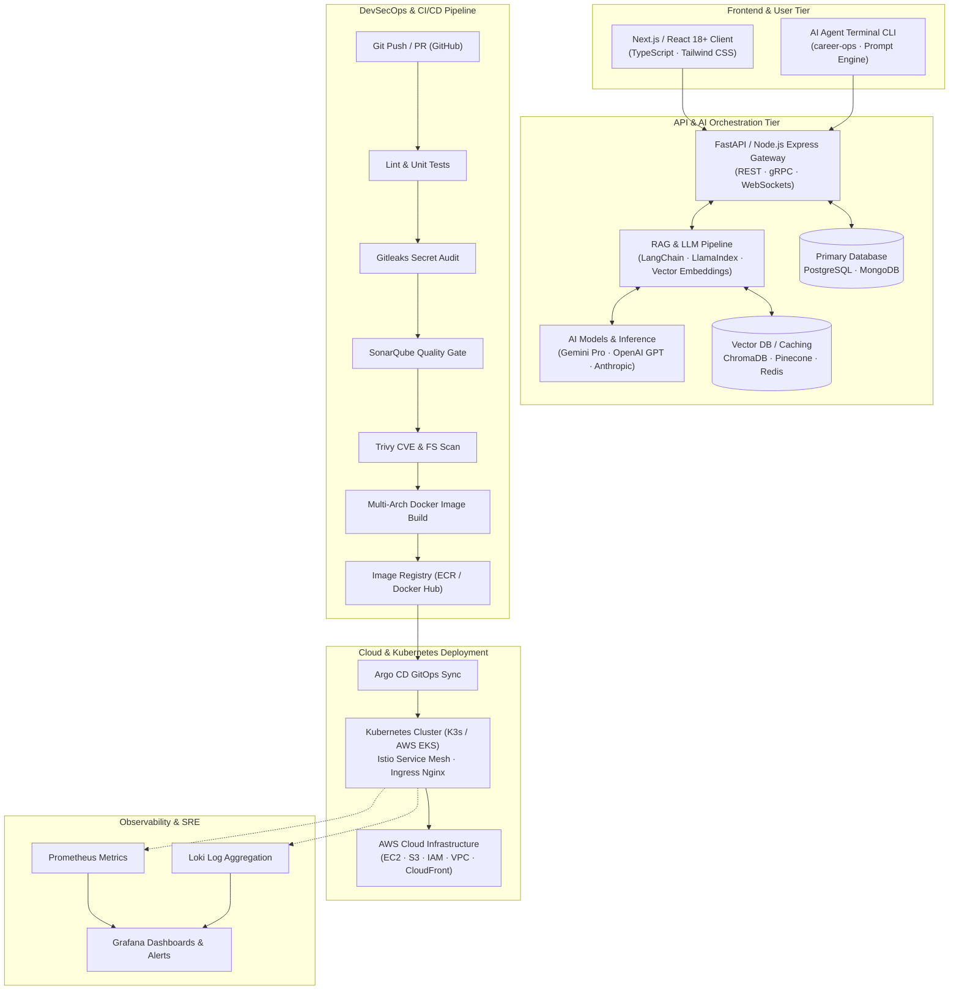

<h1 align="center">
  
  Hi, I'm <span style="color:#2E9EF7;">Majidulla SK</span>
</h1>

<h3 align="center">🚀 AI Full-Stack Engineer | Cloud Architect & DevSecOps Specialist</h3>

<p align="center">
  
</p>

<p align="center">
  <a href="https://live-resume-2-0.vercel.app/"></a>
  <a href="https://linkedin.com/in/majidulla-sk-1190a2286"></a>
  <a href="https://x.com/majidulla_sk"></a>
  <a href="mailto:majidullask04@gmail.com"></a>
  <a href="https://github.com/Majidullask04"></a>
</p>

<p align="center">
  
  <a href="https://github.com/Majidullask04"></a>
  
  
</p>

---

### 🧠 About Me

Passionate **AI Full-Stack Engineer** and **Cloud/DevOps Practitioner** building end-to-end intelligent web systems, scalable microservices, and automated multi-cloud infrastructures.

- 🤖 **AI & GenAI Systems**: Engineering production-ready Generative AI solutions, LLM workflows, Retrieval-Augmented Generation (RAG) pipelines, Autonomous Agentic CLI tools, and vector embeddings using **LangChain**, **FastAPI**, **Python**, and OpenAI/Gemini/Anthropic APIs.
- 💻 **Modern Full-Stack Development**: Crafting dynamic, ultra-responsive user interfaces in **Next.js**, **React**, **TypeScript**, and **Tailwind CSS**, powered by resilient microservices and REST/gRPC backends in **Node.js**, **Express**, and **FastAPI**.
- ☁️ **Cloud Architecture & DevSecOps**: Architecting robust cloud infrastructure on **AWS** (EC2, S3, IAM, VPC, CloudFront, EKS, CloudWatch), automated zero-trust CI/CD pipelines (**Jenkins**, **GitHub Actions**, **SonarQube**, **Trivy**, **Gitleaks**), and GitOps Kubernetes platforms (**K3s**, **EKS**, **Argo CD**, **Istio**).
- 🌐 **Open Source & Community**: Active contributor to **CNCF (Cloud Native Computing Foundation)** ecosystem projects (**CLOWarden**, **LFX Crowdfunding**) through the prestigious **Linux Foundation (LFX Mentorship)** program.
- 🎓 **Education**: B.Tech in Computer Science and Engineering (2023–2027) at **Brilliant Institute of Engineering and Technology (JNTUH)**, Hyderabad — **CGPA 7.5**.
- 📍 **Location**: Hyderabad, Telangana, India
- 📫 **Contact**: [majidullask04@gmail.com](mailto:majidullask04@gmail.com) | [Explore Live Portfolio & Resume](https://live-resume-2-0.vercel.app/)

---

### 🛠️ Tech Stack & Technical Arsenal

<p align="center">
  
</p>
<p align="center">
  
</p>

<table width="100%">
  <thead>
    <tr>
      <th width="30%">Domain</th>
      <th width="70%">Technologies, Frameworks & Tooling</th>
    </tr>
  </thead>
  <tbody>
    <tr>
      <td><b>🤖 AI & GenAI / MLOps</b></td>
      <td>
        <code>Python</code> <code>FastAPI</code> <code>LangChain</code> <code>LlamaIndex</code> <code>RAG Architecture</code> <code>Vector Embeddings</code> <code>ChromaDB / Pinecone</code> <code>Gemini API</code> <code>OpenAI API</code> <code>Hugging Face</code> <code>Agentic Workflows</code> <code>Prompt Engineering</code>
      </td>
    </tr>
    <tr>
      <td><b>💻 Frontend Engineering</b></td>
      <td>
        <code>React.js</code> <code>Next.js</code> <code>TypeScript</code> <code>JavaScript (ES6+)</code> <code>Tailwind CSS</code> <code>Vite</code> <code>HTML5</code> <code>CSS3</code> <code>Redux Toolkit / Zustand</code> <code>Responsive & Modern UI/UX</code>
      </td>
    </tr>
    <tr>
      <td><b>⚙️ Backend & API Design</b></td>
      <td>
        <code>Node.js</code> <code>Express.js</code> <code>FastAPI</code> <code>RESTful APIs</code> <code>gRPC</code> <code>WebSockets</code> <code>Microservices Architecture</code> <code>JWT / OAuth 2.0</code> <code>Pydantic</code>
      </td>
    </tr>
    <tr>
      <td><b>🗄️ Databases & Storage</b></td>
      <td>
        <code>MongoDB</code> <code>PostgreSQL</code> <code>MySQL</code> <code>Redis (Caching)</code> <code>AWS S3</code> <code>Prisma / Mongoose</code> <code>Vector Databases</code>
      </td>
    </tr>
    <tr>
      <td><b>☁️ Cloud & Infrastructure</b></td>
      <td>
        <b>AWS</b> (<code>EC2</code>, <code>S3</code>, <code>IAM</code>, <code>VPC</code>, <code>CloudFront</code>, <code>EKS</code>, <code>ECR</code>, <code>CloudWatch</code>, <code>Amplify</code>), <code>Terraform (IaC)</code>, <code>Linux (Ubuntu)</code>, <code>Bash / Shell Scripting</code>, <code>Nginx Reverse Proxy</code>
      </td>
    </tr>
    <tr>
      <td><b>📦 Containers & Orchestration</b></td>
      <td>
        <code>Docker</code> <code>Docker Compose</code> <code>Kubernetes (K3s, EKS)</code> <code>Helm Charts</code> <code>Istio Service Mesh</code> <code>Distributed Tracing</code>
      </td>
    </tr>
    <tr>
      <td><b>🛡️ CI/CD & DevSecOps</b></td>
      <td>
        <code>Jenkins (Declarative Pipelines)</code> <code>GitHub Actions</code> <code>Argo CD (GitOps)</code> <code>SonarQube (Quality Gates)</code> <code>Trivy (Vulnerability Scanning)</code> <code>Gitleaks (Secret Detection)</code>
      </td>
    </tr>
    <tr>
      <td><b>📊 Observability & SRE</b></td>
      <td>
        <code>Prometheus (Metrics Scraping)</code> <code>Grafana (Dashboards & Alerts)</code> <code>Loki (Log Aggregation)</code> <code>CloudWatch Logs</code>
      </td>
    </tr>
  </tbody>
</table>

---

### 🌟 Featured AI & Full-Stack Projects

<table>
  <tr>
    <td width="50%" valign="top">
      <h3>🤖 <a href="https://github.com/Majidullask04/career-ops">career-ops</a></h3>
      <p><b>Open-Source Autonomous AI Job Search & Terminal Agent</b></p>
      <p>An intelligent CLI agent that analyzes job listings across multiple portals, computes multidimensional A–F fit scores against user skill profiles, generates dynamically tailored resumes, and automates local application tracking via AI coding CLIs.</p>
      <p>
        <code>AI Agent</code> <code>TypeScript</code> <code>Node.js</code> <code>RAG</code> <code>CLI Automation</code> <code>Prompt Engineering</code>
      </p>
      <p>
        <a href="https://career-ops.org"><b>🌐 Live Website</b></a> · <a href="https://github.com/Majidullask04/career-ops"><b>📂 GitHub Repo</b></a>
      </p>
    </td>
    <td width="50%" valign="top">
      <h3>🎓 <a href="https://github.com/Majidullask04/examaid-pro">ExamAid Pro</a></h3>
      <p><b>AI-Enhanced Full-Stack Educational Platform on AWS</b></p>
      <p>Comprehensive academic assistance portal featuring intelligent assessment workflows, built with React, Vite & TypeScript on the frontend, and a high-throughput FastAPI backend containerized with Docker, hardened with SonarQube audits, and deployed on AWS EC2.</p>
      <p>
        <code>React</code> <code>TypeScript</code> <code>FastAPI</code> <code>Python</code> <code>AWS EC2</code> <code>Docker</code> <code>Nginx</code>
      </p>
      <p>
        <a href="https://github.com/Majidullask04/examaid-pro"><b>📂 GitHub Repo</b></a>
      </p>
    </td>
  </tr>
  <tr>
    <td width="50%" valign="top">
      <h3>🛡️ <a href="https://github.com/Majidullask04/3-Tier-DevSecOps-Mega-Project">3-Tier DevSecOps Mega Project</a></h3>
      <p><b>Enterprise CI/CD & Kubernetes GitOps Platform</b></p>
      <p>Production-ready automated pipeline dynamically discovering and building 11+ microservices with zero-trust security checks: Gitleaks secrets audit, SonarQube quality gates, Trivy CVE vulnerability scans, and continuous deployment to K3s Kubernetes via Argo CD.</p>
      <p>
        <code>Jenkins</code> <code>Docker</code> <code>Kubernetes (K3s)</code> <code>SonarQube</code> <code>Trivy</code> <code>Argo CD</code> <code>AWS</code>
      </p>
      <p>
        <a href="https://github.com/Majidullask04/3-Tier-DevSecOps-Mega-Project"><b>📂 GitHub Repo</b></a> · <a href="https://github.com/Majidullask04/microservices-devops-platform-Documentation-"><b>📖 Architecture & Proof</b></a>
      </p>
    </td>
    <td width="50%" valign="top">
      <h3>☁️ <a href="https://github.com/Majidullask04/Majid-s-DevOps-implementation-of-Google-s-project.">Google Cloud Microservices Platform</a></h3>
      <p><b>10-Microservice Distributed Architecture & Service Mesh</b></p>
      <p>Full implementation of Google Cymbal Shops microservices across Kubernetes with Istio Service Mesh, gRPC inter-service communication, distributed tracing, automated load balancing, and self-healing telemetry.</p>
      <p>
        <code>Go</code> <code>Kubernetes</code> <code>Istio</code> <code>gRPC</code> <code>Docker</code> <code>Helm</code> <code>Cloud Native</code>
      </p>
      <p>
        <a href="https://cymbal-shops.retail.cymbal.dev"><b>🌐 Live Demo</b></a> · <a href="https://github.com/Majidullask04/Majid-s-DevOps-implementation-of-Google-s-project."><b>📂 GitHub Repo</b></a>
      </p>
    </td>
  </tr>
  <tr>
    <td width="50%" valign="top">
      <h3>🏥 <a href="https://github.com/Majidullask04/HomeoCare_2.0">HomeoCare 2.0</a></h3>
      <p><b>Modern Healthcare & Digital Consultation Portal</b></p>
      <p>Full-stack healthcare consultation and patient records portal with appointment booking, practitioner scheduling, responsive medical dashboards, and continuous automated CI/CD deployments on Vercel.</p>
      <p>
        <code>TypeScript</code> <code>React</code> <code>Vite</code> <code>Tailwind CSS</code> <code>REST APIs</code> <code>Vercel</code>
      </p>
      <p>
        <a href="https://homeo-care-2-0.vercel.app"><b>🌐 Live App</b></a> · <a href="https://github.com/Majidullask04/HomeoCare_2.0"><b>📂 GitHub Repo</b></a>
      </p>
    </td>
    <td width="50%" valign="top">
      <h3>💰 <a href="https://github.com/Majidullask04/Expense-tracker">Smart Expense Tracker Web App</a></h3>
      <p><b>Full-Stack Financial Dashboard & Visual Analytics</b></p>
      <p>Interactive expense manager featuring real-time transaction tracking, categorical spending analytics, visual budget breakdowns, and automated cloud deployments.</p>
      <p>
        <code>JavaScript</code> <code>React</code> <code>Node.js</code> <code>Chart.js</code> <code>CSS3</code> <code>Vercel</code>
      </p>
      <p>
        <a href="https://expense-tracker-delta-taupe-40.vercel.app"><b>🌐 Live App</b></a> · <a href="https://github.com/Majidullask04/Expense-tracker"><b>📂 GitHub Repo</b></a>
      </p>
    </td>
  </tr>
  <tr>
    <td width="50%" valign="top">
      <h3>🌐 <a href="https://github.com/Majidullask04/clowarden">CLOWarden (CNCF Ecosystem)</a></h3>
      <p><b>Cross-Service Resource Access Management</b></p>
      <p>Open-source project in the Cloud Native Computing Foundation (CNCF) ecosystem for policy-based resource access management. Authored maintainer documentation, CI setup, and community reviews.</p>
      <p>
        <code>Go</code> <code>CNCF</code> <code>Linux Foundation</code> <code>YAML</code> <code>GitOps</code>
      </p>
      <p>
        <a href="https://github.com/Majidullask04/clowarden"><b>📂 GitHub Repo</b></a>
      </p>
    </td>
    <td width="50%" valign="top">
      <h3>⚡ <a href="https://github.com/Majidullask04/ci-cd-automation">CI/CD Security Automation</a></h3>
      <p><b>7-Stage Automated Security & Governance Pipeline</b></p>
      <p>Automated security pipeline executing static code analysis, zero-trust secrets audits, and container vulnerability scanning prior to pushing hardened images to container registries.</p>
      <p>
        <code>Jenkins</code> <code>Docker</code> <code>SonarQube</code> <code>Trivy</code> <code>Gitleaks</code> <code>Bash</code>
      </p>
      <p>
        <a href="https://github.com/Majidullask04/ci-cd-automation"><b>📂 GitHub Repo</b></a>
      </p>
    </td>
  </tr>
</table>

---

### 🏗️ End-to-End AI Full-Stack & DevSecOps Architecture



---

### 💼 Experience & Open Source Leadership

```text
2024 – Present   CNCF Open Source Contributor    | Linux Foundation (LFX Mentorship)
                 • Active contributor to CNCF ecosystem projects (CLOWarden, LFX Crowdfunding)
                 • Authored developer guides, documentation workflows, and resolved maintainer setups

2023 – Present   AI Full-Stack & Platform Eng.  | Personal Projects & Open Source
                 • Built production-grade AI tools (career-ops) and full-stack web applications
                 • Architected 11+ microservice CI/CD pipelines with zero-trust DevSecOps & Argo CD GitOps
                 • Reduced build & deployment iteration cycles by 90% across distributed environments

2023 – 2027      B.Tech Computer Science & Eng.  | Brilliant Institute of Engineering and Technology (JNTUH)
                 • CGPA: 7.5 | Hyderabad, Telangana
                 • Core: Data Structures & Algorithms, OS, DBMS, Computer Networks, AI/ML Foundations

2024             Global Hackathon Participant    | Major League Hacking (MLH Global Hack Week)
                 • Built real-time web services, integrated AI APIs, and collaborated in global dev sprints
```

---

### 🎯 Certifications & Professional Learning

- 📜 **AWS Certified Cloud Practitioner** — *In Progress / Preparing*
- 📜 **Certified Kubernetes Administrator (CKA)** — *In Progress / Preparing*
- 📜 **HashiCorp Certified: Terraform Associate** — *In Progress / Preparing*
- 🏆 **LFX Open Source Mentorship Program** — *Completed*
- 🎖️ **MLH Global Hack Week** — *Participated*

---

### 📊 GitHub Activity & Statistics

<p align="center">
  
  
</p>

<p align="center">
  
</p>

<p align="center">
  
</p>

---

### 🐍 Contribution Activity Snake

<p align="center">
  <picture>
    <source media="(prefers-color-scheme: dark)" srcset="https://raw.githubusercontent.com/Majidullask04/Majidullask04/output/github-contribution-grid-snake-dark.svg" />
    <source media="(prefers-color-scheme: light)" srcset="https://raw.githubusercontent.com/Majidullask04/Majidullask04/output/github-contribution-grid-snake.svg" />
    
  </picture>
</p>

<p align="center">
  
</p>

---

### 📬 Let's Connect & Collaborate

<p align="center">
  <a href="https://live-resume-2-0.vercel.app/"></a>
  <a href="https://linkedin.com/in/majidulla-sk-1190a2286"></a>
  <a href="https://x.com/majidulla_sk"></a>
  <a href="mailto:majidullask04@gmail.com"></a>
</p>

<p align="center">
  <i>"Building intelligent, resilient full-stack systems and cloud-native solutions powered by modern AI."</i>
</p>
